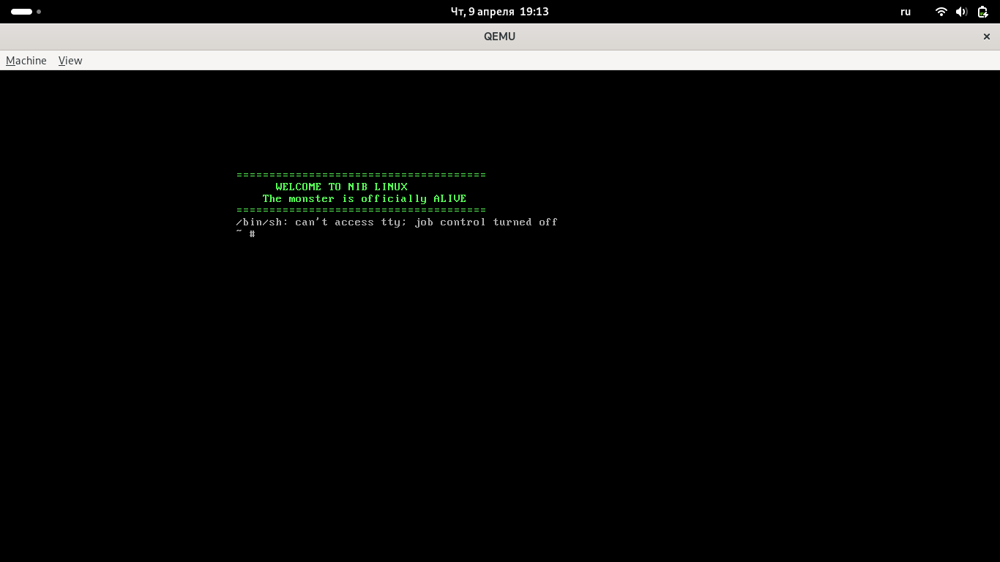

# NIB Linux (Monster Edition) v0.1

  
  
  
  

---

## 👹 What is NIB Linux?

**NIB Linux** is a minimalist, custom Linux distribution built entirely from scratch, using the official Linux kernel and a statically linked BusyBox as its initial RAM filesystem (`initramfs`).

This project is a journey into the deepest parts of OS development, starting with the kernel boot process and culminating in a functional, RAM-bootable environment managed by efficient **Shell** scripting.

## 🛠 Features

* **Vanilla Kernel:** Running on the stable and powerful **Linux Kernel 6.8.0**.
* **Zero Dependencies:** Statically linked binaries ensure NIB is standalone and robust.
* **Shell-Powered Init:** Lightweight and transparent boot process.
* **QEMU & UEFI Support:** Bootable as an ISO image on virtual and real hardware.

---

## 🚀 Show Me the Monster!

Here is a screenshot of NIB Linux v0.1 booting in QEMU, proudly displaying its first words:

  

---

## 🏗 How to Build and Run

To compile the kernel, prepare the `rootfs`, and generate the ISO image, you will need `build-essential`, `cpio`, `xorriso`, `grub-pc-bin`, and `qemu-system-x86_64`.

### Quick Start: Build and Boot

\`\`\`bash
# Clone the repository
git clone https://github.com/NickIBrody/nib-linux.git
cd nib-linux

# Pack rootfs and build ISO (ensure your scripts are ready)
./build_nib.sh

# Run the ISO in QEMU
qemu-system-x86_64 -cdrom nib-linux.iso
\`\`\`

## 🤝 Contribution

Feel free to fork this repository, open issues, and submit pull requests. Let's build a better monster together!

## 📄 License

This project is licensed under the MIT License - see the [LICENSE](LICENSE) file for details.
